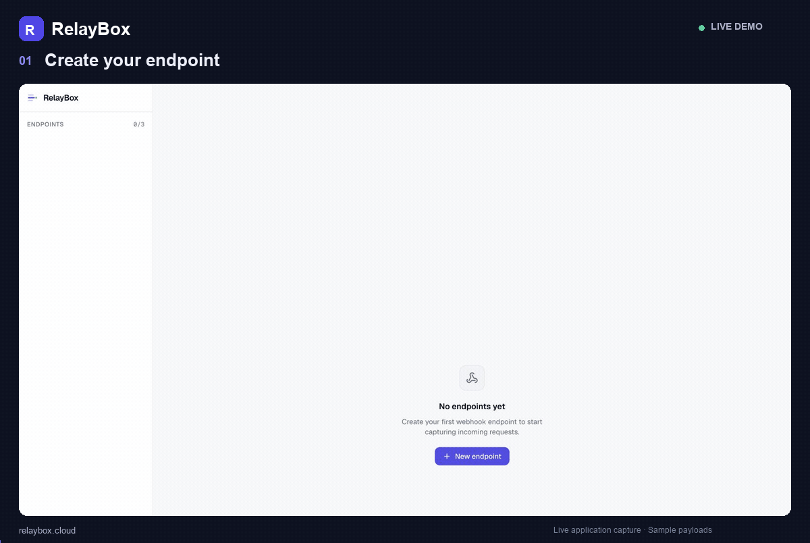
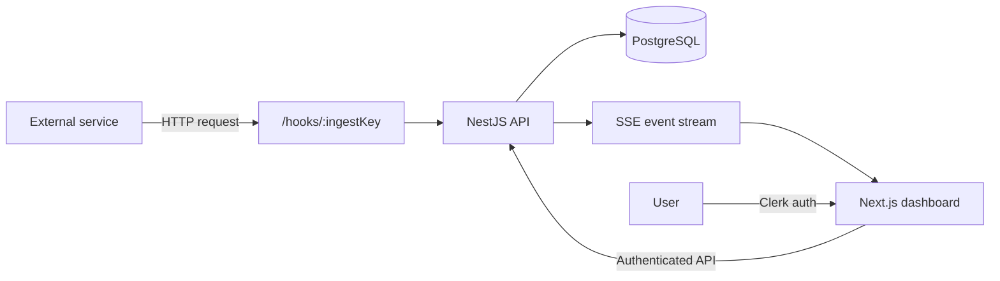

# Relaybox

Real-time webhook inspection for developers.

[](https://github.com/DanilKuprin1/relaybox/actions/workflows/ci.yaml)
[](LICENSE)
[](https://relaybox.cloud)

[](https://www.typescriptlang.org/)
[](https://nestjs.com/)
[](https://nextjs.org/)
[](https://react.dev/)
[](https://www.postgresql.org/)
[](https://www.prisma.io/)
[](https://tailwindcss.com/)
[](https://clerk.com/)
[](https://sentry.io/)
[](https://vitest.dev/)

**Live:** https://relaybox.cloud

Relaybox gives each user unique webhook endpoints, captures incoming HTTP requests, stores them in PostgreSQL, and streams new requests to the dashboard in real time.




## What it does

- Creates unique webhook ingestion endpoints
- Captures payloads, headers, query parameters, method, and request metadata
- Persists request history in PostgreSQL
- Streams new requests to authenticated users with Server-Sent Events
- Provides authenticated webhook management and per-user access control
- Includes production monitoring, structured logging, automated tests, and CI

## Architecture



Public webhook ingestion is separated from authenticated management APIs. Incoming requests are persisted first, while SSE provides low-latency updates to connected clients.

## Tech stack

**Backend:** TypeScript, NestJS, PostgreSQL, Prisma, Clerk, Server-Sent Events, Zod, Sentry, Pino, Vitest

**Frontend:** Next.js, React, TypeScript, Tailwind CSS, TanStack Query, Clerk, Sentry

**Tooling:** Docker Compose, pnpm, GitHub Actions, ESLint

## Engineering highlights

### Public ingestion + authenticated ownership

Webhook traffic is accepted through:

```text
/hooks/:ingestKey
```

The ingestion key identifies the destination webhook. Management APIs and event streams require authentication, keeping request data scoped to the correct user.

### Real-time delivery without polling

Newly captured requests are pushed to the dashboard using Server-Sent Events:

```ts
@Sse()
stream(@CurrentUser() user: DbUser) {
  return this.events
    .streamFor(user.id)
    .pipe(map((event) => ({ data: JSON.stringify(event) })));
}
```

PostgreSQL remains the durable source of truth, so request history survives client disconnects.

### Production-oriented backend

The project includes:

- Clerk authentication integrated into NestJS guards/interceptors
- Versioned PostgreSQL migrations
- Runtime validation with Zod
- Sentry error monitoring
- Structured logging with Pino
- Backend test coverage with Vitest
- CI on every pull request and push to `main`

## Repository structure

```text
relaybox/
├── backend/              # NestJS API, auth, ingestion, events, persistence
│   └── migrations/       # Versioned PostgreSQL migrations
├── frontend/             # Next.js dashboard
├── .github/workflows/    # CI
├── docs/                 # Screenshots
└── docker-compose.yaml   # Local PostgreSQL
```

## Run locally

### Prerequisites

- Node.js 24
- pnpm 11
- Docker
- A Clerk application (development instance)

### 1. Start PostgreSQL

```bash
docker compose up -d
```

### 2. Backend

```bash
cd backend
cp .env.example .env     # defaults already match docker-compose.yaml
pnpm install
pnpm db:migrate          # creates the users, webhooks and requests tables
pnpm start:dev           # http://localhost:3001
```

### 3. Frontend

In a second terminal:

```bash
cd frontend
cp .env.example .env.local
pnpm install
pnpm dev                 # http://localhost:3000
```

Both apps must point at the **same** Clerk application. If the publishable key is
missing, Clerk falls back to keyless mode and every authenticated API call returns
`401`. If the two apps use different Clerk applications, tokens are rejected with
`jwk-kid-mismatch`.

After editing `backend/src/prisma/contract.prisma`, regenerate the contract
artifacts with `pnpm contract:emit` and plan a migration with
`pnpm exec prisma migration plan`.

## Tests and CI

Backend:

```bash
cd backend
pnpm test
pnpm test:cov
```

Frontend:

```bash
cd frontend
pnpm lint
pnpm build
```

GitHub Actions runs backend coverage and frontend lint/build checks automatically.

## Why I built it

Webhook integrations are difficult to debug because the interesting part often happens at a system boundary: an external service sends a request, but the receiving application gives little visibility into what actually arrived.

Relaybox gave me a practical way to design around those boundaries: public ingestion, authenticated ownership, durable persistence, real-time delivery, observability, and testing in a TypeScript/NestJS application.

## License

MIT — see [LICENSE](LICENSE).

## Author

**Danil Kuprin**

- LinkedIn: https://www.linkedin.com/in/danilkuprin1
- Live project: https://relaybox.cloud
